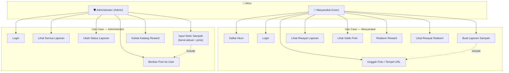
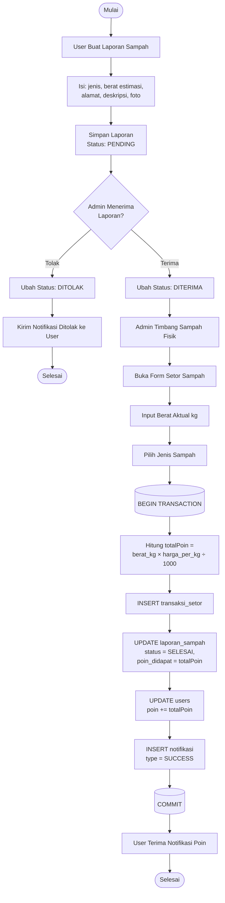
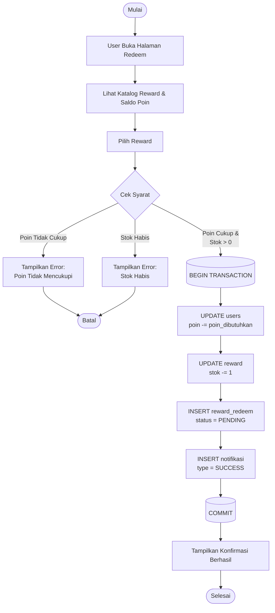
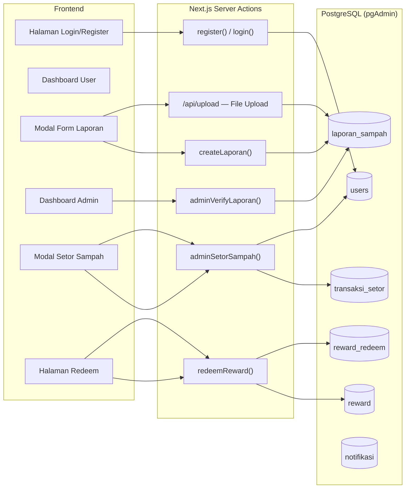

# Dokumentasi UML & ERD — Sistem Pengelolaan Sampah "Rubbish"

> Salin notasi Mermaid di bawah ke [Mermaid Live Editor](https://mermaid.live), [draw.io](https://draw.io), atau langsung paste ke dokumen Word/PDF.

---

## 1. Use Case Diagram



---

## 2. Activity Diagram — Transaksi Setor Sampah



---

## 3. Activity Diagram — Transaksi Redeem Poin



---

## 4. Entity Relationship Diagram (ERD)

```mermaid
erDiagram
    users {
        UUID    id              PK
        VARCHAR nomor_identitas UK
        VARCHAR nama
        VARCHAR email           UK
        VARCHAR no_hp           UK
        TEXT    password
        ENUM    tipe_pendaftaran
        ENUM    role
        INTEGER poin
        TIMESTAMPTZ created_at
        TIMESTAMPTZ updated_at
    }

    jenis_sampah {
        UUID    id          PK
        VARCHAR nama_jenis  UK
        TEXT    deskripsi
        NUMERIC harga_per_kg
        TIMESTAMPTZ created_at
        TIMESTAMPTZ updated_at
    }

    wilayah {
        UUID    id           PK
        VARCHAR nama_wilayah UK
        VARCHAR kode_wilayah UK
        TIMESTAMPTZ created_at
        TIMESTAMPTZ updated_at
    }

    laporan_sampah {
        UUID    id              PK
        UUID    user_id         FK
        UUID    jenis_sampah_id FK
        UUID    wilayah_id      FK
        NUMERIC berat
        TEXT    alamat_jemput
        TEXT    foto_url
        TIMESTAMPTZ tanggal_lapor
        TEXT    deskripsi
        ENUM    status
        ENUM    prioritas
        INTEGER poin_didapat
        TIMESTAMPTZ created_at
        TIMESTAMPTZ updated_at
    }

    foto_sampah {
        UUID    id         PK
        UUID    laporan_id FK-UK
        TEXT    image_url
        TIMESTAMPTZ created_at
    }

    transaksi_setor {
        UUID    id              PK
        UUID    laporan_id      FK-UK
        UUID    admin_id        FK
        UUID    jenis_sampah_id FK
        NUMERIC berat_kg
        INTEGER total_poin
        TIMESTAMPTZ created_at
    }

    reward {
        UUID    id              PK
        VARCHAR nama
        TEXT    deskripsi
        INTEGER poin_dibutuhkan
        INTEGER stok
        TEXT    gambar_url
        ENUM    kategori_reward
        TIMESTAMPTZ created_at
        TIMESTAMPTZ updated_at
    }

    reward_redeem {
        UUID    id             PK
        UUID    user_id        FK
        UUID    reward_id      FK
        INTEGER poin_digunakan
        ENUM    status
        TIMESTAMPTZ created_at
    }

    notifikasi {
        UUID    id      PK
        UUID    user_id FK
        VARCHAR judul
        TEXT    pesan
        ENUM    type
        BOOLEAN is_read
        TIMESTAMPTZ created_at
    }

    users           ||--o{ laporan_sampah   : "membuat"
    users           ||--o{ reward_redeem    : "menukarkan"
    users           ||--o{ notifikasi       : "menerima"
    users           ||--o{ transaksi_setor  : "memproses (admin)"

    jenis_sampah    ||--o{ laporan_sampah   : "dikategorikan dalam"
    jenis_sampah    ||--o{ transaksi_setor  : "digunakan dalam"

    wilayah         ||--o{ laporan_sampah   : "berlokasi di"

    laporan_sampah  ||--o| foto_sampah      : "memiliki foto"
    laporan_sampah  ||--o| transaksi_setor  : "diproses menjadi"

    reward          ||--o{ reward_redeem    : "ditukarkan dalam"
```

---

## 5. Ringkasan Tabel & Constraints

| Tabel | Primary Key | Unique Keys | CHECK Constraints | ON DELETE |
|---|---|---|---|---|
| `users` | `id` (UUID) | `email`, `nomor_identitas`, `no_hp` | `poin >= 0`, format email, no_hp ≥10 digit | — |
| `jenis_sampah` | `id` (UUID) | `nama_jenis` | `harga_per_kg > 0` | — |
| `wilayah` | `id` (UUID) | `nama_wilayah`, `kode_wilayah` | — | — |
| `laporan_sampah` | `id` (UUID) | — | `berat > 0`, `poin_didapat >= 0` | user→CASCADE, jenis/wilayah→RESTRICT |
| `foto_sampah` | `id` (UUID) | `laporan_id` (1-to-1) | — | laporan→CASCADE |
| `transaksi_setor` | `id` (UUID) | `laporan_id` (1-to-1) | `berat_kg > 0`, `total_poin >= 0` | laporan→CASCADE, admin/jenis→RESTRICT |
| `reward` | `id` (UUID) | — | `poin_dibutuhkan > 0`, `stok >= 0` | — |
| `reward_redeem` | `id` (UUID) | — | `poin_digunakan > 0` | user→CASCADE, reward→RESTRICT |
| `notifikasi` | `id` (UUID) | — | — | user→CASCADE |

---

## 6. Alur Sistem Keseluruhan


